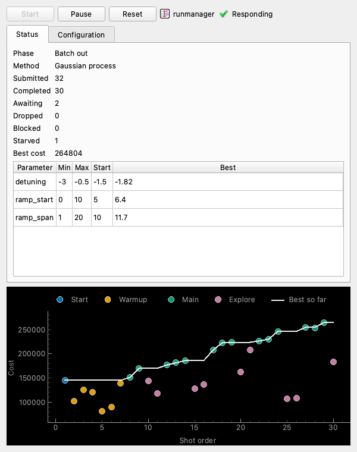

The optimizer window
====================

Adding the routine to lyse opens the optimizer window, shown in :numref:`fig-window`. It is the routine's lyse window: the controls below are its central widget, and lyse adds an Output dock and a View menu. The window is titled with the routine folder's name. Messages from the session, including tracebacks, appear in its Output dock.

.. _fig-window:

    The optimizer window, loaded with the example configuration and illustrative data. The Status tab is above and the plot below.

Controls
--------

Start
    Starts or resumes submission. It is enabled while the session is paused and has not ended, and runmanager is answering. It first checks that runmanager's globals evaluate. If they do not, the session stays paused and the phase says why.

Pause
    Stops new submissions. It is enabled while the session is running. Shots already queued still run, and the session still takes their costs and applies its limits.

Reset
    Discards the history, reads the configuration file again and opens a new paused session from it, so an edit to the file takes effect at Reset. The Method, the parameter table and the Configuration tab show the file as it was just read. The new session starts a new runmanager sequence. Shots the old session queued stay in runmanager's queue and run, but the new session ignores their costs. Reset leaves runmanager's values as they are and keeps the original values that Restore original values writes back. If the file does not load, the phase reads ``Ended:`` and the reason, and no traceback is printed: fix the file and press Reset again.

Set best values
    Sets the Default values of the globals the configuration sets, in runmanager, to those of the shot with the best cost, and submits no shot. It is enabled while the session is paused or has ended, once a usable cost has arrived, and runmanager is answering. A run otherwise leaves runmanager showing the last proposal it submitted.

Restore original values
    Writes back the Default expressions that runmanager held for those globals before the optimizer first ran, exactly as they were written, so ``2*pi*5`` comes back as ``2*pi*5``. Each global is recorded once, at the first Start that is not refused of a session whose configuration sets it, and kept through Pause and Reset, so Restore original values works after a Reset and puts back the same values. A Reset to a file that sets another global records that one at its first Start, and Restore original values still writes back a global the file no longer sets. A recorded global is recorded again only when the routine is restarted. A global that is in no active group in runmanager any more is skipped and the others are written, and the Output dock gets one line, ``Restored runmanager's values, except those in no active group: <globals>``. It is enabled while the session is paused or has ended, once they are recorded, and runmanager is answering.

Start from runmanager values
    A box in the second row, to the right of the two buttons. Ticked at the run's first Start, it opens the run at runmanager's current values of the parameters instead of the configuration's ``start``: the first shot is that point, and reads ``start`` in the ``phase`` column as a configured one does. It applies to every parameter the configuration searches, whether or not the file gives them a ``start``, and nothing else about how the run begins changes. The box is always enabled, and is read only at a run's first Start: a Start that resumes the run does not read runmanager again, whether or not it is ticked. Reset opens a new run, which has its own first Start. lyse remembers whether the box is ticked when the routine restarts.

    The values are the Default values runmanager shows for the globals, evaluated, so "current" is whatever runmanager shows when Start is pressed. A session that ended has set its best values there, if it had a best, and one that was paused or reset leaves the last proposal it submitted. To open a new run at the values runmanager held before the optimizer first ran, press Restore original values, before or after Reset, and then Start.

    Start refuses, and the session stays paused with the reason in the phase, when a value is outside its parameter's ``min`` and ``max``, when a global does not hold a real number, or when a parameter reaches runmanager only through an ``expr``, so its value cannot be read back. :ref:`troubleshooting:Start from runmanager values is refused` gives the messages.

When a session ends, for whatever reason, it sets the best values in runmanager as Set best values does, if there is a best. It does not engage a shot, so runmanager runs them at once only if it is running default shots. If runmanager does not take the values from either button or from the end of a session, the Output dock gets one line, "Could not set runmanager's values:" and the reason, and the session is left as it was.

A session that has ended can only be reset, or have runmanager's values set. All five buttons are disabled while the window reads "Opening", and Reset is enabled as soon as the session has opened or ended.

The runmanager indicator
------------------------

To the right of the buttons are runmanager's icon, then its name and a light that shows whether runmanager is answering. The window asks runmanager every two seconds. A tick means it answers, an exclamation mark means it does not, and an hourglass means it has not yet been asked. Under the name and the light is a short status, "Checking...", "Responding" or "Not responding", and hovering it shows the whole status. The light's tooltip names the host runmanager is expected on, and gives the reason when runmanager does not answer. Nothing is printed to the Output dock for a runmanager that is not answering.

Start, Set best values and Restore original values need the tick. Each enables itself once runmanager answers, with no Reset, and disables itself when runmanager stops. While the light shows an exclamation mark, the session does not ask runmanager what became of the shots it queued, so that Reset and Pause do not wait behind a request that would time out.

Status tab
----------

Phase
    What the session is doing:

    ``Opening``
        The session is being built.

    ``Paused``
        The session has not been started, or has been paused.

    ``Paused: <reason>``
        Something other than you paused the session: Start found an error in runmanager's globals or could not use its values for the start, or runmanager stopped answering during the run. The run is kept, and Start resumes it. :doc:`troubleshooting` lists the reasons.

    ``Running``
        A learner other than ``gaussian_process`` is proposing.

    ``Warmup``
        The Gaussian process has not yet proposed, and its explorer is gathering observations.

    ``Batch computing``
        The Gaussian process is computing a batch in the background, while its explorer keeps the queue filled.

    ``Batch out``
        The Gaussian process has proposed a batch, and none is computing.

    ``Ended: <reason>``
        The session has stopped, because it reached ``max_num_runs`` or ``max_num_runs_without_better_params``, or because something failed. :doc:`troubleshooting` lists the reasons.

Method
    The learner, such as "Gaussian process".

Counters
    These count shots. They are the session's own tallies and are not saved into lyse's dataframe.

    .. list-table::
        :widths: 20 80

        * - Submitted
          - Shots the session has submitted to runmanager.
        * - Completed
          - Shots whose cost the session has taken, usable or not.
        * - Awaiting
          - Submitted shots that have neither reported a cost nor been given up on.
        * - Dropped
          - Shots that will not produce a cost: deleted from runmanager's queue or no longer held by it, failed to compile, refused by BLACS, not handed to lyse because Analyse is off in runmanager or lyse rejected the file, or stuck behind a queue row an operator has to clear. A cost that arrives later is still taken, and its shot stops counting as dropped.
        * - Blocked
          - The dropped shots waiting in runmanager's queue behind a row only an operator can clear, such as a shot that failed to compile. They are counted in Dropped too.
        * - Starved
          - How often the session ran and found none of its shots queued, so runmanager gave BLACS a default shot. ``differential_evolution`` empties the queue by design and does not count it. See :ref:`troubleshooting:Starved counts`.

Best cost
    The best usable cost so far, in the units and sign of your cost column, so a maximized cost is shown as measured. It reads "—" until a usable cost has arrived.

Parameter table
    One row for each enabled parameter, with its name, ``min``, ``max`` and the point the run opens at. The Start column holds the configuration's ``start``, which reads "—" when the parameters have none, or runmanager's values once a Start with Start from runmanager values ticked has read them. The Best column holds the parameter values of the shot with the best cost, in real units, and reads "—" until there is one.

Configuration tab
-----------------

The Configuration tab shows the text of the TOML file as it was last loaded, when the routine started or at the last Reset that read it. It is read only.

The Edit in text editor button above the text opens the configuration file itself, not the text shown, in a text editor, and does not wait for it. The text box's right-click menu has the same item, after Copy and Select All. The editor is the program set as ``text_editor`` under ``[programs]`` in the labconfig, run with ``text_editor_arguments`` from the same section, in which each ``{file}`` stands for the file's path; with no ``{file}`` the path comes before the arguments. It is the editor that runmanager's edit button uses. If no editor is set, or it cannot be launched, a dialog says so. The tab goes on showing the text it has until Reset reads the edited file.

The plot
--------

The plot shows each usable cost against the position of its shot among the session's proposals. Costs have the sign of your cost column. Shots that are pending, dropped or bad leave gaps. The color of a point says what proposed the shot, the same value as the ``phase`` column of :doc:`results`: the configured start, warmup shots, the main learner, or explorer shots. A white line follows the best cost so far. The legend above the plot lists a source once it has a point on the plot, and "Best so far" once there is a best cost.

Closing the window
------------------

Closing the window hides it and leaves the session running. To show it again, right-click the routine in lyse's Multishot routines box and choose "show windows for selected routines". Removing or restarting the routine ends the session. Shots it has queued stay in runmanager's queue.

When the opening fails
----------------------

The session opens without contacting runmanager, so a runmanager that is not running does not fail the opening: the indicator shows it instead. If the session cannot be built at all, the phase reads ``Ended:`` followed by the reason, the traceback is in the Output dock, and only Reset is enabled. Fix the cause, then press Reset, which tries the opening again. A configuration file that does not load at a Reset ends the session in the same way, with no traceback and no session, because the file is yours to fix; the window goes on showing the file as it was last loaded, and lyse's shots are analyzed as usual but none of them is the optimizer's. Edit the file and press Reset again. See :doc:`troubleshooting`.
